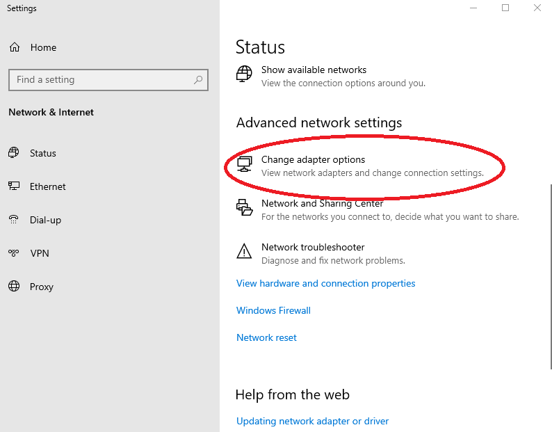

# Active Directory Lab

## Table of Contents

- [Objective](#objective)
- [Hardware Requirements](#hardware-requirements)
- [Software Requirements](#software-requirements)
- [Part 1: Creating the Domain Controller Virtual Machine](#part-1-creating-the-domain-controller-virtual-machine)
- [Part 2: Configuring the Domain Controller Virtual Machine](#part-2-configuring-the-domain-controller-virtual-machine)
- [Part 3: Installing Windows Server 2019 onto the Domain Controller Virtual Machine](#part-3-installing-windows-server-2019-onto-the-domain-controller-virtual-machine)
- [Part 4: Logging into and Renaming the Domain Controller Virtual Machine](#part-4-logging-into-and-renaming-the-domain-controller-virtual-machine)
- [Part 5: Creating the Help Desk Virtual Machine](#part-5-creating-the-help-desk-virtual-machine)
- [Part 6: Configuring the Help Desk Virtual Machine](#part-6-configuring-the-help-desk-virtual-machine)
- [Part 7: Installing Windows 10 Enterprise onto the Help Desk Machine](#part-7-installing-windows-10-enterprise-onto-the-help-desk-machine)
- [Part 8: Logging into and Configuring the Help Desk Machine](#part-8-logging-into-and-configuring-the-help-desk-machine)
- [Part 9: Adding Active Directory to the Domain Controller Machine](#part-9-adding-active-directory-to-the-domain-controller-machine)
- [Part 10: Creating a Help Desk Account in Active Directory](#part-10-creating-a-help-desk-account-in-active-directory)
- [Part 11: Adding the Help Desk Machine to the Domain](#part-11-adding-the-help-desk-machine-to-the-domain)
- [Part 12: Logging into the Help Desk Virtual Machine](#part-12-logging-into-the-help-desk-virtual-machine)
- [Part 13: Creating a New Staff Virtual Machine and Active Directory Account](#part-13-creating-a-new-staff-virtual-machine-and-active-directory-account)

## Objective
The purpose of this lab is to create a virtual environment on a local Windows machine to simulate a domain network.  
This network will utilize Windows Active Directory and will consist of a Domain Controller and client machines.  

## Hardware Requirements
- **Windows machine with virtualization enabled** (Recommended: 16 GB+ RAM and 60 GB+ disk space)

## Software Requirements
- [**VirtualBox**](https://www.virtualbox.org/)
- [**Windows Server 2019 ISO**](https://www.microsoft.com/en-us/evalcenter/evaluate-windows-server-2019)
- [**Windows 10 Enterprise ISO**](https://www.microsoft.com/en-us/evalcenter/evaluate-windows-10-enterprise)

## Program Walk-through

### Part 1: Creating the Domain Controller Virtual Machine

1. Open VirtualBox.
2. Click **New**.
3. Name the new virtual machine whatever you like. For this lab, the name **DC** is used.
4. Select the Windows Server 2019 ISO file for the virtual machine's ISO image and check **Unattended Installation**.

  

5. Click **Next**.
6. Allocate at least 4 GB (4000 MB) for **Base Memory** and at least 2 CPUs for **Processors**.  
   **Note:** Do not choose a value in the red zone.

  

7. Click **Next**.
8. Select **Create a Virtual Hard Disk Now** and choose a disk size of at least 50 GB.

  

9. Click **Next**.
10. Confirm all details of the new virtual machine are correct, then click **Finish**.

### Part 2: Configuring the Domain Controller Virtual Machine

1. In VirtualBox Manager, right-click your Domain Controller virtual machine and select **Settings**.

  

2. From the left-hand menu, select **System**.  
3. Under **Boot Order**, uncheck **Floppy** and ensure **Optical** and **Hard Disk** are checked. This makes the VM boot faster and avoids unnecessary errors.

  

4. From the left-hand menu, select **Network**.  
5. Configure **Adapter 1** to be attached to **Bridged Adapter**. This allows the Domain Controller to communicate with client machines on the same network.

  

6. Click **OK** to save the settings and close the window.

### Part 3: Installing Windows Server 2019 onto the Domain Controller Virtual Machine

1. Start your Domain Controller virtual machine and wait until you see a window labeled **Windows Setup**.

  

2. Click **Next**.  
3. Click **Install Now**.  
4. From the list of available operating systems, click **Windows Server 2019 Datacenter Evaluation (Desktop Experience)**.  
5. Click **Next**.  
6. Carefully read the license terms, then click **Next** to accept.
7. Click **Next**.  
8. Select **Custom: Install Windows only (advanced)**.  
9. Select the drive you allocated for this virtual machine.

  

10. Click **Next**.  
11. Wait for Windows to install and the machine to automatically restart.  
12. When prompted, enter a password for the Administrator account and re-enter it to confirm.

  

13. Click **Finish**.  
14. Wait until the lock screen appears.

  

### Part 4: Logging into and Renaming the Domain Controller Virtual Machine

1. To reach the login page from the lock screen, click **Input** on the top bar of the virtual machine's window.
2. Hover over the **Keyboard** option in the menu.
3. Click **Insert Ctrl+Alt+Delete**.

  

4. Enter the correct password for the **Administrator** account.
5. Right-click on the Windows icon located on the bottom left.
6. Click **System**.
7. Scroll down in the "About" section and click the button labeled **Rename This PC**.
8. Enter a name for your Domain Controller machine. In this lab, the name **DC** is used.
9. Click **Next**.
10. Restart the virtual machine.

### Part 5: Creating the Help Desk Virtual Machine

1. Open VirtualBox.
2. Click on **New**.
3. Name the new virtual machine whatever you like. For this lab, the name **HelpDesk** is used.
4. Select the Windows 10 Enterprise ISO file for the virtual machine's ISO image and check the **Unattended Installation** option.

  

5. Click **Next**.
6. Allocate at least 4 GB (4000 MB) for **Base Memory** and at least 2 CPUs for **Processors**.  
   **Note:** Do not choose a value in the red zone.

  

7. Click **Next**.
8. Select **Create a Virtual Hard Disk Now** and choose a disk size. A size of around 50 GB is recommended, but smaller (e.g., 35 GB) may also work if system resources are limited.

  

9. Click **Next**.
10. Confirm all details of the new virtual machine are correct, then click **Finish**.

### Part 6: Configuring the Help Desk Virtual Machine

1. In VirtualBox Manager, right-click your help desk virtual machine and select **Settings**.

  

2. From the left-hand menu, select **System**.  
3. Under **Boot Order**, uncheck **Floppy** and ensure **Optical** and **Hard Disk** are checked. This makes the VM boot faster and avoids unnecessary errors.

  

4. From the left-hand menu, select **Network**.  
5. Configure **Adapter 1** to be attached to **Bridged Adapter**. This allows the Domain Controller to communicate with client machines on the same network.

  

6. Click **OK**.

### Part 7: Installing Windows 10 Enterprise onto the Help Desk Machine

1. Start your help desk virtual machine and wait until you see a window labeled **Windows Setup**.

  

2. Click **Next**.  
3. Click **Install Now**.  
4. Accept the license terms after reading them.  
5. Click **Next**.  
6. Select **Custom: Install Windows only (advanced)**.  
7. Select the drive you allocated for this virtual machine.

  

8. Click **Next**.  
9. Wait for the installation to complete and for the machine to automatically restart.  
10. When prompted for your region, select the correct region.  
11. Click **Yes**.  
12. Select the correct keyboard layout.  
13. Click **Yes**.  
14. Skip the option for a second keyboard layout unless needed.  
15. When asked to sign in with Microsoft, click **Domain join instead**.  
16. Enter a name for the user using this PC. In this lab, the name **admin** is used.
17. Click **Next**.  
18. Enter a valid password.  
19. Click **Next**.  
20. Re-enter the password.  
21. Click **Next**.  
22. For the 3 security questions, select a question, provide a text-based answer, and click **Next** until all three questions are completed.  
23. Configure your preferred privacy settings.  
24. Click **Accept**.  
25. When prompted to set up Cortana, select **Not Now** unless needed.  
26. Wait until you are logged in.

### Part 8: Logging into and Configuring the Help Desk Machine

1. Right-click the Windows icon located at the bottom left.  
2. Click **System**.  
3. Scroll down in the **About** section and click the button labeled **Rename This PC**.  
4. Enter a name for your client machine. In this lab, the name **HelpDesk** was used.
5. Click **Next**.  
6. Restart the machine to apply changes.

### Part 9: Adding Active Directory to the Domain Controller Machine

1. Launch your Domain Controller virtual machine from the VirtualBox Manager.  
2. Log in to your Domain Controller virtual machine.  
3. Left-click the Windows icon located at the bottom left of the screen.  
4. Select **Server Manager** from the menu.

  

5. In **Server Manager**, click **Manage** at the top of the window.

  

6. From the menu that appears, click **Add Roles and Features**.  
7. Click **Next** until you reach **Server Roles**.  
8. Under **Roles**, select **Active Directory Domain Services**.  
9. Click **Add Features**.  
10. Click **Next** until you reach **Confirmation**.  
11. Click **Install** and wait for the installation to complete.  
12. Click **Promote this server to a domain controller**.

  

13. For **Deployment Configuration**, select **Add a new forest**.  
14. Enter a root domain name. Common endings include ".local", ".com", ".org", and ".net". In this lab, "james.org" is used.

  

15. Click **Next**.
16. Enter a password for **Directory Services Restore Mode (DSRM)**.  
17. Click **Next** until reaching the **Additional Options** section.  
18. For the **NetBIOS name**, the wizard will suggest a default based on the root domain name.  
    - Example: default NetBIOS name is **JAMES**.  

    If providing a custom NetBIOS name, follow these rules:  
    - Maximum of **15 characters**  
    - No spaces or special characters  
    - Use **uppercase letters**  

19. Click **Next** until reaching the **Prerequisites Check** section.  
20. Click **Install** and wait for the Domain Controller VM to finish restarting.

### Part 10: Creating a Help Desk Account in Active Directory

1. Launch your Domain Controller virtual machine from the VirtualBox Manager.  
2. Open **Server Manager**.  
3. Click **Tools**.  
4. From the dropdown menu, click **Active Directory Users and Computers**.

  

5. In the left-hand column, double-click your root domain name. This will expand to show more folders, including **Users**.

  

6. Click the **Users** folder.  
7. On the top bar, click the icon to add a new user.

  

8. In the new window, enter the details for the helpdesk user: first name, last name, and a User logon name. In this lab, **Help** and **Desk** were used for the name, and the logon name was set to **helpdesk**.  
9. Click **Next**.  
10. Uncheck **User must change password at next logon**.  
11. Enter and confirm a valid password.  
12. Click **Next**.  
13. Click **Finish**. The new user should now appear in the list of users.

  

14. Double-click the newly created helpdesk user to open its properties.  
15. Click the **Member Of** tab at the top of the properties window.

  

16. Click **Add** to open the **Select Groups** window.  
17. In the **Select Groups** window, type **domain admins** in the text box at the bottom.  

  

18. Click **OK**. "Domain Admins" should now appear under the **Member Of** list.

  

19. Click **OK** to close the properties window.  
20. Press **Windows + R** to open the Run dialog.  
21. Type `cmd` and click **OK**.  
22. In the Command Prompt, type `ipconfig /all` and press **Enter**.  
23. Note the IP Address listed as **IPv4 Address**. This will be needed in the next section.

### Part 11: Adding the Help Desk Machine to the Domain

1. Launch your Help Desk virtual machine from the VirtualBox Manager.  
2. Log into the machine.  
3. Right-click the network icon located on the right side of the bottom taskbar.

  

4. Click **Open Network & Internet settings**.  
5. Scroll down under the **Status** section and click **Change adapter options**.

  

6. Right-click **Ethernet**.  
7. Click **Properties**.  
8. Double-click **Internet Protocol Version 4 (TCP/IPv4)** to open its properties window.

  

9. In the properties window, select **Use the following DNS server addresses**.  

  

10. For **Preferred DNS Server**, enter the IPv4 address obtained in the previous section.  
11. Click **OK**.  
12. Right-click the Windows icon on the bottom bar and select **System**.

  

13. Scroll down in the **About** section and click **Advanced System Settings**.  

  

14. In the **System Properties** window, click the **Computer Name** tab.  
15. Click **Change**.

  

16. Under **Member of**, select **Domain**.  
17. Enter your root domain name.  

  

18. Click **OK**.  
19. When prompted, enter the credentials for the help desk account created in Active Directory.  
20. Click **OK**.  
21. Restart the machine to apply the changes.

### Part 12: Logging into the Help Desk Virtual Machine

1. Launch your Help Desk virtual machine from the VirtualBox Manager.  
2. When prompted to log in, click **Other User**.  
3. You should see the **NetBIOS name** of your domain appear in the sign-in prompt.  
   Enter the credentials for the help desk account you created in Active Directory.  

   **Note:** Do not use your local machine credentials for this step.

  

### Part 13: Creating a New Staff Virtual Machine and Active Directory Account

The process is almost identical to the steps in **Part 5–12** (Help Desk machine setup):  
- Follow the same steps to create and configure a Windows 10 virtual machine.  
- In Active Directory, create a new user account (see Part 10) but do **not** add the account to the **Domain Admins** group. By default, new accounts are placed in the **Domain Users** group, which is sufficient for standard users.  
- Finally, join the new VM to the domain the same way you did with the Help Desk machine.